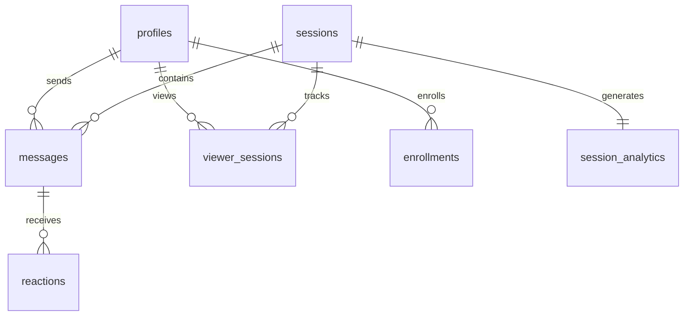

# Live-Web Supabase Documentation

**Project ID**: `kgkntdvckufhdomygkoj`  
**Updated**: January 7, 2026

---

## Overview

| Metric | Value |
|--------|-------|
| **Tables** | 9 |
| **Migrations** | 21 |
| **RPC Functions** | 5 |
| **Indexes** | 15+ |
| **RLS** | ✅ All tables |

---

## Schema



### Tables

| Table | Purpose |
|-------|---------|
| `profiles` | User data (linked to auth.users) |
| `sessions` | Live/simulive streaming sessions |
| `messages` | Chat with moderation support |
| `viewer_sessions` | Viewer tracking |
| `enrollments` | User enrollments |
| `reactions` | Message reactions |
| `session_analytics` | Computed analytics |
| `active_sessions` | Session gating |

### Key Columns

**sessions**
- `screen_url`, `face_url` - Dual video for simulive
- `scheduled_start` - Authoritative start time
- `stream_start_time` - Actual stream start

**messages**
- `message_type` - user/admin/system/private
- `target_user_id` - Private message recipient
- `is_pinned` - Pinned status

---

## RPC Functions

| Function | Purpose |
|----------|---------|
| `get_server_time()` | Server time for simulive sync |
| `get_current_viewers(session_id)` | Active viewer count |
| `leave_session(session_id, user_id)` | Mark viewer as left |
| `compute_session_analytics(session_id)` | Generate analytics |
| `handle_new_user()` | Trigger for new auth users |

All functions have `SET search_path = public` for security.

---

## Indexes

| Table | Index | Purpose |
|-------|-------|---------|
| messages | `idx_messages_session_created` | Pagination |
| messages | `idx_messages_user_id` | Author lookup |
| viewer_sessions | `idx_viewer_sessions_session_active` | Active count |
| sessions | `idx_sessions_live` | Live sessions |
| active_sessions | `idx_active_sessions_email` | User lookup |

---

## RLS Policies

All tables have Row Level Security enabled.

### Key Patterns
- `(SELECT auth.uid())` - Optimized auth check
- `user_id IS NULL OR user_id = auth.uid()` - Guest + auth support

---

## Environment Variables

```bash
VITE_SUPABASE_URL=https://kgkntdvckufhdomygkoj.supabase.co
VITE_SUPABASE_ANON_KEY=your-anon-key
```

---

## Common Queries

```sql
-- Active viewers
SELECT COUNT(*) FROM viewer_sessions 
WHERE session_id = $1 AND left_at IS NULL;

-- Server time
SELECT get_server_time();

-- Live sessions
SELECT * FROM sessions WHERE is_live = true;
```

---

## Links

- [Dashboard](https://supabase.com/dashboard/project/kgkntdvckufhdomygkoj)
- [RLS Guide](https://supabase.com/docs/guides/auth/row-level-security)
